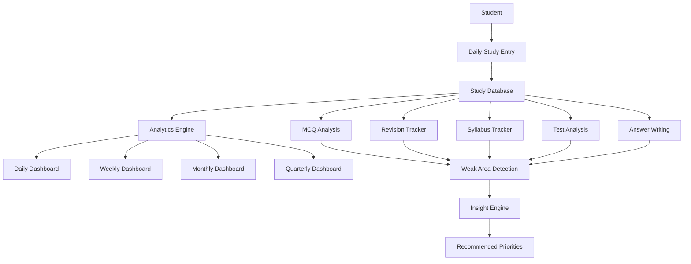
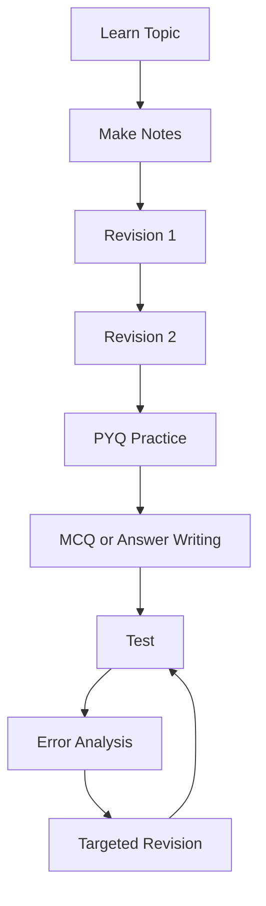
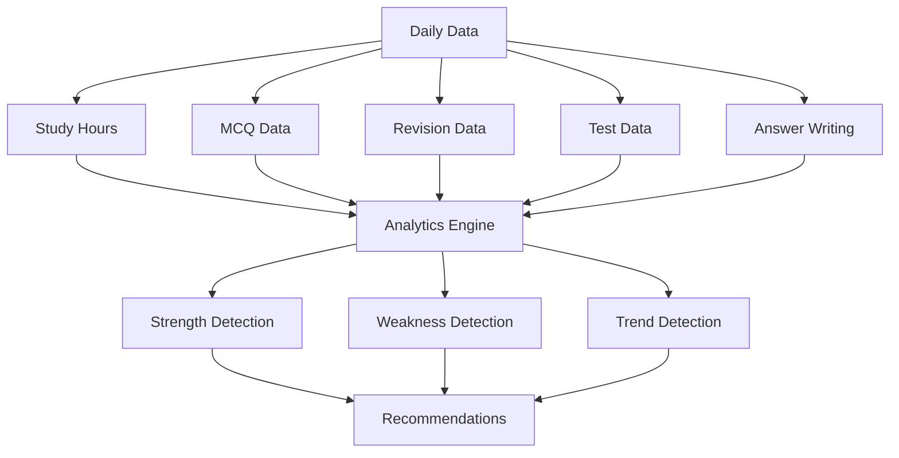
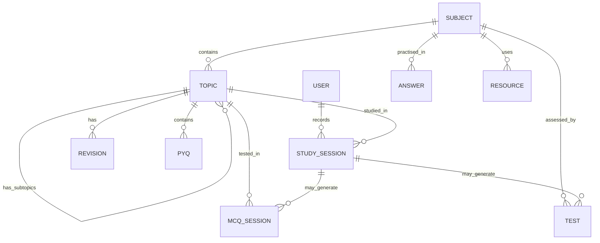

# UPSC Preparation Command Center

A responsive, local-first UPSC CSE preparation web app. Understand what you studied, how your indicators changed, what needs revision, and what to work on next. This is a React website, not a spreadsheet. It runs without a backend and deploys as a static site on GitHub Pages.

## Get started

Requirements: **Node.js 22 or newer** and npm.

```bash
git clone https://github.com/YOUR_USERNAME/YOUR_REPOSITORY.git
cd YOUR_REPOSITORY
npm install
npm run dev
```

Open the local address printed by Vite (port 4173 by default). First launch shows a skippable six-step setup wizard. Enter your target year, Optional, daily study target, planned exam dates, weekly practice goals, and allocation percentages. Exam dates start blank; enter dates from your official calendar.

Choose **Explore with fictional demo data** during setup or **Settings → Load Demo Data** to explore a realistic six-month preparation history. Demo mode is clearly labeled. Loading demo data replaces the current workspace after confirmation if records already exist. Export a backup first. Clear Demo Data removes fictional records, clears unchanged fictional exam dates, and resets untouched seeded syllabus progress; personal entries, edited topics, and needed resource/series references remain.

## Main features

- 19 routes: Dashboard, Daily Study, Syllabus, Prelims, Mains, Optional, CSAT, Current Affairs, Answer Writing, Essay, MCQ Analysis, PYQs, Tests, Revision, Weak Areas, Goals, Reports, Resources, and Settings.
- Full study form with start/end times, stage/paper, subject/topic/subtopic, resource/activity, planned and actual minutes, questions, marks, PYQs, answers, revision, focus, energy, difficulty, distraction, notes, gaps, and next revision date.
- Dedicated MCQ, test, answer, essay, ethics case study, current affairs, PYQ, revision, resource, goal, and catalog forms.
- Expandable syllabus hierarchy with direct status changes, topic details, completion history, leaf-topic treemap, and paper progress.
- Editable Optional with Paper I → Unit → Topic → Subtopic and Paper II. Add unlimited custom subjects and hierarchy levels.
- Custom study activities, courses, coaching modules, test series, categories, resources, and goals. New entries appear in relevant forms, filters, and analytics.
- Hours trend, subject bars, stage donut, target versus actual study balance, subject radar, contribution heatmap, daily timeline, weekly stacked bars, accuracy and test trends, error charts, answer scatter plot, priority quadrants, knowledge-health cards, and indicator matrices.
- Revision calendar with due-today, upcoming, completed, and overdue states. Select dates, complete or reschedule revisions, and inspect topic learning stages.
- Daily, weekly, monthly, rolling quarterly, and yearly reports; matched elapsed-period comparisons; separate units for hours, counts, and percentages; downloadable text reports.
- Configurable, transparent productivity scoring and rule-based insights with observation, evidence, rationale, action, and target.
- Universal search for subjects, topics, notes, tests, PYQs, resources, current affairs, essays, answers, and practice records.
- Light/dark/system theme, mobile bottom navigation and full navigation drawer, keyboard-operable forms, accessible dialog focus, labeled controls, explanations, and empty states.
- JSON backup/restore with validation and confirmation, CSV export for every data collection, and storage failure/recovery messages.
- Installable PWA with offline access after a successful initial online load.

## Production build

```bash
npm run typecheck
npm run test
npm run test:ui
npm run build
npm run preview
```

The output is `dist/`. The build also generates a versioned service worker that precaches the app shell, icons, stylesheet, and all lazy-loaded route/chart chunks. No server or database is necessary.

Do not open `index.html` by double-clicking it. ES modules and service workers require an HTTP server. Use `npm run dev`, `npm run preview`, or a static host.

## Exact GitHub Pages deployment

1. Create a GitHub repository, e.g. `upsc-command-center`.
2. Put the project contents at the repository root: `package.json`, `src/`, `public/`, `vite.config.ts`, `.github/`, and the other included files. Do not put a second enclosing `upsc-command-center/` directory in the repository root.
3. Push the files to the `main` branch. If you use Git locally:

   ```bash
   git init
   git add .
   git commit -m "Add UPSC preparation app"
   git branch -M main
   git remote add origin https://github.com/YOUR_USERNAME/upsc-command-center.git
   git push -u origin main
   ```

4. In the GitHub repository, open **Settings → Pages → Build and deployment → Source** and choose **GitHub Actions**.
5. Open **Actions → Deploy to GitHub Pages → Run workflow** and run it on `main`. Subsequent pushes to `main` deploy automatically.
6. Wait for both `build` and `deploy` jobs to succeed. Your app will be at `https://YOUR_USERNAME.github.io/upsc-command-center/` (or the URL shown in the deploy job).

The included workflow uses Node 22, installs from `package-lock.json`, runs analytics/storage and rendered-UI checks, builds the app, uploads `dist`, and deploys it with GitHub's Pages actions. The repository owner must allow Actions and Pages deployment. No app credentials are needed.

### Routing and asset paths

`HashRouter` keeps routes in the URL fragment: `.../upsc-command-center/#/reports`. Refreshing a nested route requests the repository's existing `index.html`, so Pages does not need rewrites or a custom 404 page. Vite's `base: './'` produces relative asset URLs that work on root domains and repository subdirectories without replacing a repository name in configuration.

A custom domain can be configured through GitHub Pages. Add the domain through GitHub's Pages settings and, where needed, a `public/CNAME` file. This project is prepared for deployment; it has not been pushed to or deployed from your GitHub account.

## Tech stack

React 19 · TypeScript · Vite 6 · Tailwind CSS 4 · Recharts 3 · Lucide React · React Router · LocalStorage.

Styles use deliberate shared theme tokens and responsive CSS, alongside the Tailwind Vite integration. Analytics and validation are plain TypeScript. Routes load lazily, expensive views memoize aggregations, records paginate, and storage is behind an adapter interface.

## Data storage and backup

Data is stored under `upsc-command-center:v1` in the browser's LocalStorage. Records persist through refresh. There is no backend, account, cloud upload, API key, analytics service, or external AI service. The browser optional WebMCP capability is feature-detected; ordinary app use does not require it.

Storage is specific to the browser profile and origin. A GitHub Pages app, a local preview, a new domain, and a different browser have different workspaces. JSON export/import transfers data between them. Browser clearing or private browsing can remove data. Use **Settings → Export Data · JSON** regularly.

The JSON backup includes all settings, subjects, topics and their histories, sessions, MCQs, tests, answers, essays, ethics records, current affairs, PYQs, revisions, resources, catalog items, and goals. Imports validate the version, required types, dates, counts, scoring limits, thresholds, allocation total, references, duplicate IDs, and hierarchy cycles before replacing data. A corrupted saved workspace is preserved rather than silently overwritten. The Settings recovery control can export its raw bytes.

CSV exports are available from each record table and Settings. They include IDs as well as readable subject/topic labels, escape commas and quotation marks, and neutralize leading spreadsheet formulas. CSV exports are for analysis; **only JSON backups are restorable**.

LocalStorage supports a useful personal dataset but has browser-dependent size limits, commonly a few megabytes. Storage failure is surfaced before a change is applied. For larger multi-user datasets, replace `DataRepository` with an IndexedDB or cloud adapter.

## How the analytics work

- **Hours:** actual session minutes / 60; planning is tracked separately. Distraction minutes are reported separately and are not silently subtracted.
- **MCQ accuracy:** total correct / total attempted, weighted by question counts. Practice sets linked to study sessions are counted once. Correct + incorrect must equal attempted in dedicated MCQ records.
- **Study-form questions:** a scored linked MCQ record is created automatically when questions are fully marked. Its counts feed the same analytics. Editing that study session replaces its generated MCQ record; keep detailed error edits in the MCQ view after the study entry is finalized.
- **Test performance:** score / each test's maximum marks. Accuracy is correct / attempted. Negative test scores are allowed to represent negative marking.
- **Answers:** detailed answer records plus answers counted in study sessions without a linked detailed answer. Do not separately count the same work twice. Average answer score only uses detailed scored records.
- **PYQs:** counts logged in sessions plus correct/incorrect counts in dedicated PYQ batches. Avoid separately logging the same batch twice. Frequency charts count PYQ entries in your dataset, not all UPSC exam questions.
- **Syllabus:** leaf topics count equally; completed/mastered/revision-due = 100%, in progress = 50%, not started = 0%. Parents are structure, not extra weighted topics. Status histories let reports measure historical coverage rather than reuse today's completion for every month. Parent-topic detail queries include descendant topic activity.
- **Revision completion:** completed scheduled revisions / revisions due in the period. **On-time health** additionally requires completion on or before the due date. Overdue backlog is incomplete past-due work. Revision activity counts include completed schedules and study entries marked Revision Done; avoid double-logging the same revision.
- **Productivity:** available component scores are capped at 100%, multiplied by configured weights, and divided by the sum of available weights. Hours and practice targets are prorated by calendar days. Focus = mean recorded focus × 10. Unmeasured accuracy, focus, and scheduled revision indicators are excluded. The dashboard lists every component and weight used.
- **Strength/weakness:** uses coverage, scheduled revision completion, sufficiently sampled MCQ accuracy, test score, and answer score. Fewer than two measured indicators = Needs data. At least two below the weakness threshold = Weak. At least 70% of measured indicators above the strength threshold = Strong. Study hours never directly determine strength or weakness.
- **Neglect:** activity gaps and target-allocation gaps are separate from knowledge weaknesses. CSAT warnings count study days without CSAT study or MCQ practice, not calendar days.
- **Radar:** coverage, revision, accuracy, PYQs as a share of the configured monthly PYQ target, mean test score, and mean answer score. Unmeasured dimensions are labeled and appear at zero in this visual; the matrix uses `—` for missing data.
- **Study balance:** each session is assigned one category. Custom allocation names can match an activity or subject. Otherwise Optional/CSAT, Current Affairs, Revision, Answer Writing, Tests, PYQs, and GS are used in that order. Targets must sum to 100%.
- **Comparisons:** reports can compare equal elapsed days. Percentage changes are reported in percentage points; counts and hours show numerical and relative changes. The current month is labeled partial. Quarterly reports examine a rolling three-month window; sustained trends are not inferred from a partial month.
- **Insights:** deterministic rules, not a remote language model. Each insight contains actual evidence, why it matters, an action, and a measurable target. Priorities consider overdue revision, low practice accuracy, upcoming tests, high-priority activity gaps, Optional allocation, and CSAT neglect. The app does not predict exam selection or qualification.

Reports and filtered charts use actual records. There are no fabricated user totals outside explicitly loaded fictional demo data. Empty periods display an actionable empty state. Exam dates and Optional syllabus content are user configurable and are not represented as official UPSC updates.

## Architecture



### Preparation flow



### Analytics flow



### Data relationships



`USER` represents the single local workspace in Version 1; no account table is persisted. Insights are derived, not stored as stale records. Subtopics use a self-referencing topic tree.

## Folder structure

```text
.github/workflows/deploy.yml   GitHub Pages CI and deployment
public/                       Manifest, favicon, install icons
scripts/generate-sw.mjs       Production offline precache generation
src/
  components/                 Layout, forms, dialogs, tables, charts' wrappers
  pages/                      Dashboard and all tracking/analytics routes
  charts/                     Responsive reusable Recharts components
  hooks/                      Persistent app context and mutation actions
  utils/                      Dates, aggregation, coverage, goals, insights
  data/                       Full subject master and fictional demo generator
  types/                      Versioned domain model
  services/                   Repository, validation, backup/CSV, optional WebMCP
  App.tsx                     Lazy HashRouter routes
  main.tsx                    Entry point and production PWA registration
  styles.css                  Light/dark tokens and responsive layout
 tests/                       Analytics/storage tests and rendered UI smoke test
 docs/                        QA and requirement notes
```

## Dashboard Preview

_Screenshot/GIF placeholder: dashboard metrics, hours trend, contribution heatmap, and next-focus priorities._

## Study Analytics

_Screenshot/GIF placeholder: hours, allocation, accuracy, radar, test trend, and answer-quality scatter plot._

## Syllabus Tracker

_Screenshot/GIF placeholder: expandable topic hierarchy, direct status controls, treemap, and topic details._

## Revision Dashboard

_Screenshot/GIF placeholder: calendar, due/overdue agenda, completion controls, and learning lifecycle._

## MCQ Analysis

_Screenshot/GIF placeholder: question funnel, error categories, subject errors, and repeated topics._

## Monthly Report

_Screenshot/GIF placeholder: matched period comparisons and separate metric charts._

## Mobile View

_Screenshot/GIF placeholder: stacked dashboard cards, responsive charts, quick add, bottom navigation, and full navigation drawer._

## Verification

`npm run typecheck` checks the full TypeScript app. `npm run test` exercises weighted accuracy, double-count prevention, filters, descendants, revision timeliness, coverage history, multi-indicator strengths, productivity, streak, custom categories, neglect warnings, invalid backups, CSV safety, and refresh persistence.

`npm run test:ui` renders the real React app in JSDOM, checks setup and empty states, loads demo data, visits all 19 routes and all report periods, saves through the actual study form, and restores a saved workspace into a second DOM. This is a rendered functional smoke test, **not a substitute for browser visual or responsive QA**.

The development environment's browser-preview infrastructure was unavailable, so desktop/mobile screenshots and real browser interaction/installation/offline tests were not verified there. Before public deployment, open the app in a real browser at 1440px, 1024px, 768px, and 375px; test keyboard-only navigation, import/export downloads, reload on a nested hash route, and airplane-mode reload after service-worker installation. See `docs/QA.md`.

## Future roadmap

The `DataRepository` interface separates persistence from the UI. A future adapter can add IndexedDB, Supabase, Firebase, or an API backed by PostgreSQL without replacing the forms or analytics. An asynchronous cloud adapter would also add loading, sync, account isolation, and conflict-resolution behavior to the context.

Planned future extensions: accounts and cloud sync, cloud backup, externally generated AI analysis, OCR notes, Telegram reminders, full mobile PWA notifications, mentor dashboards, study groups, and collaborative planning. Version 1 intentionally contains no backend infrastructure for these.

## License

`LICENSE` is an explicit placeholder. Choose and replace it with an appropriate license before open-source distribution. Dependencies retain their respective licenses.

### Deployment references

The workflow follows [GitHub's custom Pages workflow documentation](https://docs.github.com/en/pages/getting-started-with-github-pages/using-custom-workflows-with-github-pages) and [Vite's static deployment guidance](https://vite.dev/guide/static-deploy). This app uses relative build URLs with hash-based routing so repository subdirectories remain portable.
